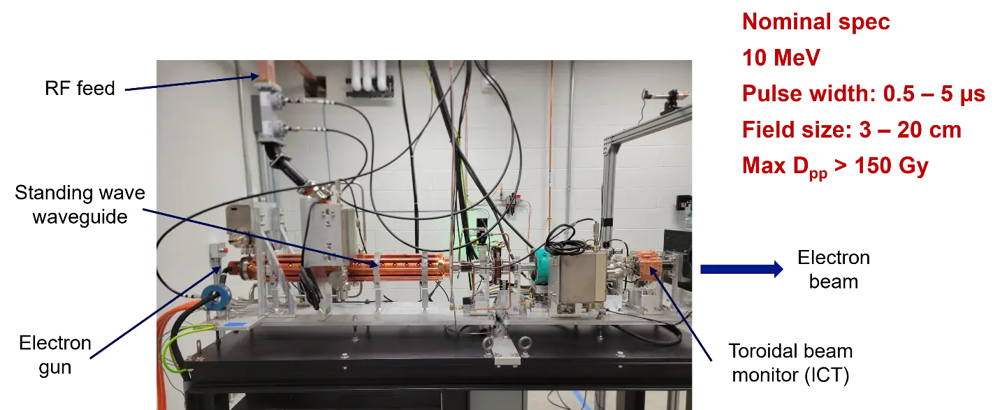
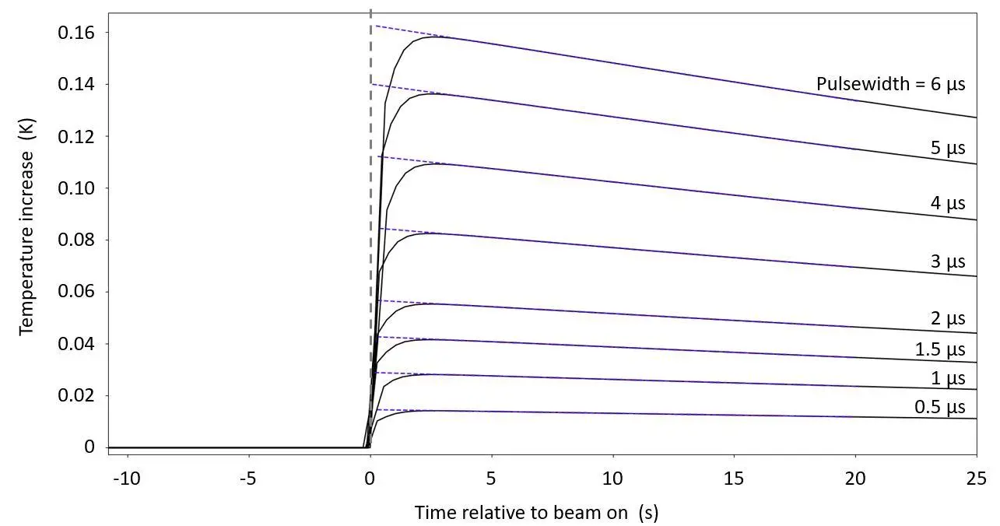

# A complementary multidetector dosimetry system for the traceable characterization of a novel UHDR electron beam

**Malcolm McEwen, James Renaud, Jean Dessureault, Zaki Gardezi, Bryan Muir**

- National Research Council Canada, Ottawa, ON, Canada

**Joel St Aubain, Kaustubh Patwardhan, Ryan Flynn, Tim Waldron, Louis Lee, John Buatti**

- Department of Radiation Oncology University of Iowa, Iowa City, IA

---

**Purpose**

To investigate the performance of a novel ultra-high dose rate (UHDR) electron beam intended for preclinical research on FLASH treatment and dosimetry. A specialized accelerator, developed by Radiabeam Technologies, was installed at the University of Iowa, providing 10 MeV irradiations, both continuous and single pulse, at dose-per-pulse values exceeding what has been reported previously (\> 250 Gy per pulse).

**Materials and Methods**

Previous studies have demonstrated the challenges of accurate dosimetry in UHDR beams and therefore a combination of detectors was used to accurately characterize accelerator beam. Portable graphite and aluminum calorimeters were used to provide real-time measurements. The ratio from two similar, but independent, calorimeters was used to verify system integrity and provide redundancy. Dose profiles were measured using Ashland HD-V2 Gafchromic film which enabled determination of a volume averaging correction for the calorimeters. Absorbed dose to water was also measured directly using alanine pellets directly traceable to national standards.

Measurements were obtained for a wide range of electron beam field sizes (FWHM of 2 to 20 cm) and dose-per-pulse values, from 0.4 Gy to 270 Gy. The sensitivity to detector alignment was investigated. The stability of a toroidal integrating current transformer (ICT), used to monitor the accelerator output was also tested over the course of the measurements.

**Results**

For the two different radial beam profiles, the calorimeters agreed to within 0.8 %, which is consistent with uncertainties. The calorimeter/ICT ratio showed very good stability over one day (standard deviation \< 0.2 %) but showed larger variations from day to day. Measurements using alanine for the highest dose per pulse yielded a value of (276 ± 4) Gy, consistent at the 2 % level with data supplied at installation.

**Conclusions**

Combining complementary dosimetry systems enable accurate characterization of UHDR beams, providing robust absorbed dose measurements with an uncertainty of around 1.5 %.

**Figure 1.** Radiabeam 10 MeV accelerator

**Figure 2.** Variation in calorimeter response with electron pulse length
