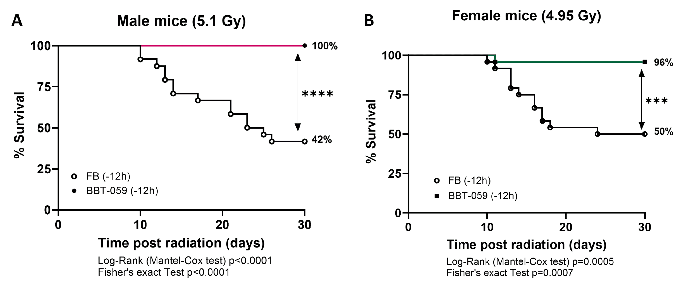

# BBT-059, a PEGylated Interleukin-11 Analog, Confers Radioprotection Against Low- and  High-LET Radiation

**Venkateshwara Dronamraju, Vidya P Kumar**  
*Henry M Jackson Foundation for the Advancement of Military Medicine, Bethesda, MD, 20817;*  
*Armed Forces Radiobiology Research Institute (AFRRI), Bethesda, MD, 20814*

**Gregory Holmes-Hampton, Sanchita P Ghosh**  
*Armed Forces Radiobiology Research Institute (AFRRI), Bethesda, MD, 20814*

**Christine Fam, George Cox**  
*Bolder Biotechnology, Boulder, CO 80301, USA*

---

**Purpose:**

Nuclear detonations pose a unique threat due to high-LET mixed-field (neutron/gamma) radiation, which causes more complex damage than standard gamma rays. This study evaluates BBT-059, a long-acting PEGylated interleukin-11 (IL-11) analog, as pre-exposure radioprotectant against hematopoietic sub-syndrome of acute radiation syndrome (H-ARS).

**Methods:**

Male and female C57BL/6 mice (11 to14 weeks old) were administered a single subcutaneous dose of BBT-059 (0.3 mg/kg) or vehicle (formulation buffer) 12 hours prior to irradiation. Mice were exposed to 0.6 Gy/min at the AFRRI High-level Cobalt-60 facility (low-LET gamma) or the TRIGA reactor facility (high-LET mixed-field) to simulate fallout and detonation scenarios, respectively.

Thirty-day survival was analyzed via Kaplan-Meier plots. Hematopoietic recovery was assessed through peripheral blood counts, serum biomarker assays, and flow cytometry of bone marrow populations. Histopathological analysis (hematoxylin and eosin staining) and RT-PCR profiler arrays for pathway analysis were performed on collected tissues. Statistical significance was determined using Mantel-Cox and Fisher’s exact tests for survival, and 2-way ANOVA for other parameters.

**Results:**

Pre-treatment with BBT-059 significantly improved 30-day survival in mice across both radiation qualities. Treated mice exhibited accelerated reconstitution of bone marrow progenitor cells and peripheral blood counts. Mechanistic analysis suggests BBT-059 mitigates H-ARS by stimulating early-stage hematopoietic stem cell recovery.

**Conclusions:**

A single pre-exposure dose of BBT-059 provides potent, broad-spectrum protection against diverse radiation types, offering a critical capability for enhancing personnel survival and operational readiness.

**Disclaimer:**

> The views expressed here are those of the authors and do not reflect the official policy of AFRRI, USUHS, DoD or the US Government. Neither the authors nor their family members have a financial interest in any commercial product, service, or organization providing financial support for this research.

**Figure 1.** Radioprotective efficacy of BBT-059 against high-LET radiation. C57BL/6 mice (A: male, B: female) were treated with BBT-059 or formulation buffer (FB) and exposed to mixed-field (neutron/gamma) radiation. Pre-treatment with BBT-059 significantly increased post-irradiation survival compared to the formulation buffer (FB) group. \*p ≤ 0.05, \*\*p ≤ 0.01, \*\*\*p ≤ 0.001, \*\*\*\*p ≤ 0.0001.
